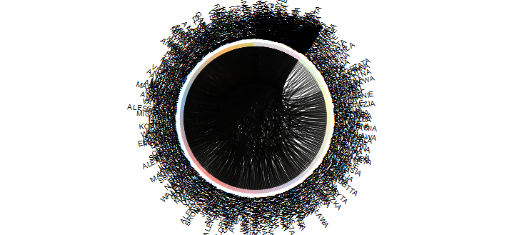

```{r setup, include=FALSE}
knitr::opts_chunk$set(warning=FALSE, message=FALSE, error=FALSE)
```

Przetwarzając dane tekstowe można zetknąć się z problemem duplikatów przybliżonych. Każdemu na pewno przydarzyło się zrobić literówkę wprowadzając dane do jakiegoś formularza. Formularz może zawierać także pytanie o dane adresowe i na przykład ulicę 3 maja można zapisać na wiele sposobów:

- 3 maja
- trzeciego maja
- 3-go maja

Podobnych przykładów można mnożyć, niemniej rezultat jest zawsze ten sam - jedna informacja i wiele jej wariantów. 

# Miary podobieństwa

W takiej sytuacji można skorzystać z pewnych miar podobieństwa tekstów (ang. fuzzy matching), które w R oprogramowane są w pakiecie [stringdist](https://cran.r-project.org/web/packages/stringdist/index.html).

Najczęściej wykorzystywane algorytmy to:

- **odległość Levenshteina** - odległość to liczba kroków wymaganych do przekształcenia jednego ciągu znaków w drugi. Działania jakie można wykonywać to wstawienie nowego znaku, usunięcie znaku lub zamianę znaku na nowy znak.
- **odległość Damerau-Levenshteina** - podobnie jak odległość Levenshteina, ale wprowadza działanie polegające na zamianie miejscami sąsiadujących znaków.
- **najdłuższy wspólny podłańcuch** (ang. longest common substring) - znajduje najdłuższy ciąg elementów leżących obok siebie w obu ciągach, natomiast odległość to liczba niesparowanych znaków.
- **odległość Jaro** - średnia z odsetka wspólnych znaków w pierwszym ciągu, odsetka wspólnych znaków w drugim ciągu oraz odsetka wspólnych znaków nie wymagających transpozycji. Przyjmuje wartości od 0 do 1, gdzie 0 to teksty identyczne, a 1 zupełnie różne.
- **odległość Jaro-Winklera** - zwiększenie podobieństwa ciągów, które według odległości Jaro są do siebie podobne.

Na podstawie wyżej opisanych algorytmów można stwierdzić, że im mniejsza wartość danej odległości tym ciągi tekstowe będą do siebie bardziej podobne. Pakiet `stringdist` zawiera implementację jeszcze kilku miar, niemniej w tym poście skupiłem się na tych najbardziej popularnych.

# Analiza imion męskich w 2015 roku

Z racji tego, że nie dysponuję bazą zawierającą takie nieuporządkowane dane tekstowe to wykorzystamy statystyki dotyczące najczęściej nadawanych imion dzieciom dostępne na stronach [Ministerstwa Cyfryzacji](https://www.gov.pl/cyfryzacja/dodatkowe-materialy). Wiemy przecież, że niektóre imiona występują w kilku wariantach np. Angelika i Andżelika, więc spróbujemy je znaleźć.

W pierwszej kolejności wczytuję pakiety oraz dane. Pakiet [chorddiag](https://github.com/mattflor/chorddiag) przyda nam się do wizualizacji uzyskanych wyników na wykresie strunowym.


```{r pakiety, warning=FALSE, message=FALSE, error=FALSE}
# devtools::install_github("mattflor/chorddiag")

library(tidyverse) # przetwarzanie
library(stringdist) # odległości pomiędzy tekstami
library(chorddiag) # wykres strunowy
library(grDevices) # kolory
library(RColorBrewer) # kolory

kolory <- grDevices::colorRampPalette(RColorBrewer::brewer.pal(9, "Set3"))

load("imiona.RData")

```

Liczba nadawanych unikalnych imion z roku na rok prawie się podwaja, co świadczy o coraz większej wyobraźni rodziców i chęci wyróżnienia dziecka już na starcie.

```{r imiona_rok_plec, preview=TRUE}
imiona %>%
  group_by(plec, rok) %>%
  count() %>%
  ungroup() %>%
  mutate(plec=factor(plec, labels=c("Kobiety", "Mężczyźni")),
         rok=as.factor(rok)) %>%
  ggplot(., aes(x=plec, y=n, fill=rok)) + 
  geom_bar(position = position_dodge(), stat = "identity") +
  theme_light() +
  xlab("Płeć") + ylab("Liczba unikalnych imion") +
  theme(legend.position = "bottom") + 
  guides(fill=guide_legend(title="Rok"))
```

Z tego względu analizie poddamy imiona męskie nadane w 2015 roku. Mniejszy zbiór danych umożliwi wizualizację w czytelniejszy sposób.

```{r}

d <- imiona %>%
  filter(rok == 2015, plec == "m")

```

Poniżej znajduje się gotowa funkcja, która zwraca zbiór z parami porównywanych tekstów i odległościami pomiędzy nimi oraz macierz, którą można przedstawić na wykresie strunowym. 

Funkcja przyjmuje trzy argumenty:

- dane - wektor tekstów, które zostaną porównane ze sobą parami,
- metoda - identyfikator metody z pakietu `stringdist`,
- granica - przyjęty poziom podobieństwa.

Rezultatem działania funkcji są dwa obiekty:

- zbior - zawiera pary porównywalnych tekstów oraz wybraną odległość pomiędzy nimi,
- macierz - macierz zawierająca wartości poniżej przyjętej granicy.

```{r}
podobne_teksty <- function(dane, metoda, granica){
  
  # policzenie odległości dla wszystkich par
  
  m <- as.matrix(stringdistmatrix(a = dane, b = dane, method = metoda))
  
  rownames(m) <- dane
  colnames(m) <- dane
  
  # wybór obserwacji z odległością poniżej określonej granicy
  
  m_g <- as.data.frame(which(m <= granica, arr.ind=TRUE)) %>%
    mutate(tekst1=rownames(.)) %>%
    filter(!row==col) %>%
    mutate(tekst2=colnames(m)[col])
  
  d <- numeric(nrow(m_g))
  
  for(i in 1:length(d)){
    d[i] <- m[m_g$row[i],m_g$col[i]]
  }
  
  m_g$d <- d
  
  # usunięcie duplikatów
  
  m_g_bd <- as.data.frame(unique(t(apply(m_g[,1:2], 1, sort))))
  names(m_g_bd) <- c("row", "col")
  
  m_g_bd_tekst <- inner_join(m_g_bd, m_g, by=c("row"="row", "col"="col"))
  
  # utworzenie macierzy do funkcji chorddiag
  
  # wybór unikalnych numerów kolumn i wierszy
  
  rc <- unique(c(m_g_bd_tekst$row, m_g_bd_tekst$col))
  
  m_g_tekst <- m[rc, rc]
  
  # zamiana odległości większej niż podana granica na 0
  
  m_g_tekst0 <- m_g_tekst
  
  m_g_tekst0[m_g_tekst0 > granica] <- 0
  
  wynik <- list(zbior=m_g_bd_tekst[-c(1,2)],
                macierz=m_g_tekst0)
  
  return(wynik)
  
}
```

W pierwszej kolejności zobaczmy jak z podobieństwem imion poradzi sobie odległość Damerau-Levenshteina. Jako granicę przyjąłem 2, co oznacza, że dopuszczam maksymalnie dwie modyfikacje pierwszego ciągu w celu otrzymania ciągu drugiego.

```{r}

dl <- podobne_teksty(dane = d$imie, metoda = "osa", granica = 2)

dl_df <- dl$zbior
dl_m <- dl$macierz

head(dl_df) %>%
  knitr::kable()
```

Następnie sprawdzam, które imię cechuje się największą liczbą sąsiadów i jak oni wyglądają. W przypadku tej odległości jest to imię ALAN, które ma 10 bliskich sąsiadów. Oznacza to, że zmieniając w imieniu ALAN maksymalnie dwa znaki można uzyskać 10 różnych imion.

```{r}

liczebnosc <- colSums(dl_m != 0)

tekst_max <- liczebnosc[which(liczebnosc==max(liczebnosc))]
tekst_max

dl_df %>%
  filter(tekst1 %in% names(tekst_max) | tekst2 %in% names(tekst_max)) %>%
  knitr::kable()

```

Do przedstawienia uzyskanych relacji najlepszy będzie wykres strunowy (ang. chord diagram). W pakiecie `chorddiag` znajduje się eRowa implementacja tego wykresu pochodząca z biblioteki [d3.js](https://d3js.org/). Większa wersja tego wykresu znajduje się [tutaj](dl.html).

```{r}
sort <- order(liczebnosc)

chorddiag(dl_m[sort, sort], 
          margin = 60, 
          palette = "Set3", 
          showTicks = F,
          groupPadding = 2,
          groupnameFontsize = 10,
          groupnamePadding = 5,
          groupThickness = .05,
          showZeroTooltips = F,
          chordedgeColor = "gray90",
          groupColors = kolory(nrow(dl_m)))

```

Zobaczmy jak zadziała metoda najdłuższego wspólnego podłańcucha. Tutaj granicę ustalam na poziomie 3 niepasujących liter. Imiona JAN oraz BRIAN cechują się występowaniem aż 8 najbliższych sąsiadów.

```{r}
lcs <- podobne_teksty(dane = d$imie, metoda = "lcs", granica = 3)

lcs_df <- lcs$zbior
lcs_m <- lcs$macierz

liczebnosc <- colSums(lcs_m != 0)

tekst_max <- liczebnosc[which(liczebnosc==max(liczebnosc))]
tekst_max

lcs_df %>%
  filter(tekst1 %in% names(tekst_max) | tekst2 %in% names(tekst_max)) %>%
  knitr::kable()
```

Wyniki także przedstawione są na wykresie strunowym ([większa wersja](lcs.html)).

```{r}
sort <- order(liczebnosc)

chorddiag(lcs_m[sort, sort], 
          margin = 60, 
          palette = "Set3", 
          tickInterval = 10, 
          showTicks = F,
          groupPadding = 1,
          groupnameFontsize = 10,      
          groupnamePadding = 5,
          groupThickness = .05,
          chordedgeColor = "gray90",
          groupColors = kolory(nrow(lcs_m)))
```

W przypadku odległości Jaro jako próg klasyfikacji sąsiada przyjąłem wartość 0.2. W tym przypadku mamy aż trzy najliczniejsze imiona - BRIAN, NATHAN oraz NATAN mają po pięciu sąsiadów.

```{r}
jd <- podobne_teksty(dane = d$imie, metoda = "jw", granica = 0.2)

jd_df <- jd$zbior
jd_m <- jd$macierz

liczebnosc <- colSums(jd_m != 0)

tekst_max <- liczebnosc[which(liczebnosc==max(liczebnosc))]
tekst_max

jd_df %>%
  filter(tekst1 %in% names(tekst_max) | tekst2 %in% names(tekst_max)) %>%
  knitr::kable()

```

Uzyskane wyniki przedstawione na wykresie strunowym ([większa wersja](jd.html)).

```{r}
sort <- order(liczebnosc)

chorddiag(jd_m[sort, sort], 
          margin = 60, 
          palette = "Set3", 
          tickInterval = 10, 
          showTicks = F,
          groupPadding = 1,
          groupnameFontsize = 10,       
          groupnamePadding = 5,
          groupThickness = .05,
          chordedgeColor = "gray90",
          groupColors = kolory(nrow(jd_m)))
```

# Analiza imion żeńskich w 2017 roku

Można jeszcze pokusić się o analizę dla roku 2017. Wybierając imiona kobiece najwięcej sąsiadów z wykorzystaniem odległości Jaro i progu podobieństwa 0.2 uzyskamy dla imienia MARINA - 45.

```{r}

d <- imiona %>%
  filter(rok == 2017, plec == "k")

jd <- podobne_teksty(dane = d$imie, metoda = "jw", granica = 0.2)

jd_df <- jd$zbior
jd_m <- jd$macierz

liczebnosc <- colSums(jd_m != 0)

tekst_max <- liczebnosc[which(liczebnosc==max(liczebnosc))]
tekst_max

jd_df %>%
  filter(tekst1 %in% names(tekst_max) | tekst2 %in% names(tekst_max)) %>%
  head(n=12) %>%
  knitr::kable()

```

Macierz odległości dla podobnych imion męskich w 2015 roku miała rozmiar 124 x 124, natomiast imiona kobiece w 2017 roku znajdują się w macierzy wielkości 686 na 686. W związku z tym przedstawienie tych danych na wykresie strunowym czyni ten wykres mało czytelnym. Wobec tego pozostaje analiza wyłącznie w oparciu o dane liczbowe.



# Podsumowanie

Wykorzystane miary odległości pomiędzy tekstami różnią się między sobą jeśli chodzi o główną ideę, stąd trudno wskazać najlepszą z nich. Każda pozwala na identyfikację najbardziej zbliżonych tekstów, ale ze względu na różne kryteria. W praktyce warto zastosować kilka miar i ocenić zaproponowane obserwacje.

Z zastosowaniem opisanych metryk można analizować duże zbiory danych, niemniej w takim przypadku wizualizacja takich danych z wykorzystaniem wykresu strunowego staje się problematyczna i należałoby się skupić wyłącznie na analizie liczbowej bądź poszukać alternatywnych sposobów wizualizacji takich danych.

# Bibliografia

1. Data Steve - [d3/R Chord Diagram of White House Petition Data](https://data-steve.github.io/d3-r-chord-diagram-of-white-house-petitions-data/)
2. Krzysztof Jankiewicz - [Hurtownie Danych, ETL – wybrane zagadnienia](http://www.cs.put.poznan.pl/kjankiewicz/hd/HD_wykl03_etl-KJ.pdf)

Kod i dane dostępne są także na [githubie](https://github.com/lwawrowski/analiza-imion)


